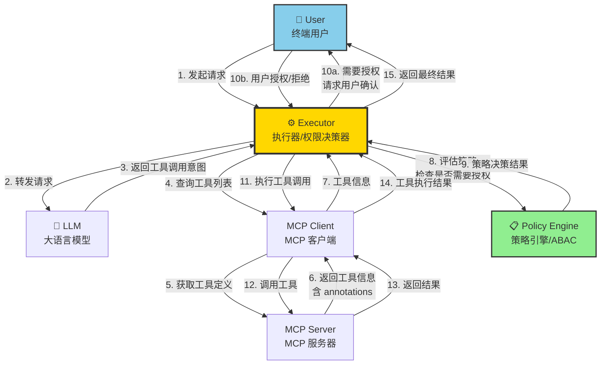

# MCP ABAC Authorization

> **基于 ABAC 的 MCP 工具权限控制** - 使用 ABAC 定义工具使用策略，让终端应用决策 LLM 访问工具时的用户授权。策略由 MCP Server 返回 tool 时候共同提供。策略仅作为建议，不用于要求 client 执行。

## 🎯 项目概述

本项目探索如何在 MCP（Model Context Protocol）架构中实现细粒度的权限控制。通过使用 **ABAC（Attribute-Based Access Control）** 定义工具的使用策略，终端应用可以根据用户属性、工具属性、上下文信息等动态决策是否允许 LLM 访问特定工具。

### 核心特性

- **策略驱动的权限控制**：使用 ABAC 策略定义工具访问规则
- **用户授权决策**：Executor 根据策略判断是否需要用户显式授权
- **细粒度控制**：支持基于工具类型、操作类型、资源声明等多维度的权限判断
- **终端应用决策**：权限决策在终端应用层完成，不依赖 MCP Server

## 🏗️ 架构设计

### 关键流程说明

1. **用户发起请求**：用户通过终端应用发起请求
2. **LLM 处理**：Executor 将请求转发给 LLM，LLM 分析并返回需要调用的工具
3. **工具发现**：Executor 通过 MCP Client 从 MCP Server 获取工具定义和元数据（包括 annotations）
4. **策略评估**：Executor 从 LLM 获取工具调用意图后，**参考工具的 Policy 和 annotations** 来确定：
   - 工具是否为只读操作（`readOnlyHint`）
   - 工具是否为破坏性操作（`destructiveHint`）
   - 是否需要用户显式授权
   - 用户是否有权限执行该操作
5. **用户授权**：如果需要授权，Executor 向用户请求确认
6. **工具执行**：获得授权后，Executor 通过 MCP Client 执行工具调用
7. **结果返回**：工具执行结果通过 Executor 返回给用户

### 核心组件

- **User（用户）**：终端用户，发起请求并授权工具调用
- **Executor（执行器）**：核心组件，负责协调 LLM、MCP Client，并根据策略进行权限决策
- **LLM（大语言模型）**：分析用户意图，决定需要调用的工具
- **MCP Client**：MCP 协议客户端，与 MCP Server 通信
- **MCP Server**：提供工具定义和工具执行能力
- **Policy Engine**：ABAC 策略引擎，评估权限策略

## 🔑 关键设计点

### 1. 策略驱动的权限控制

使用 ABAC 策略定义工具访问规则，支持：
- 基于工具属性（Tool Attributes，如 `readOnlyHint`、`destructiveHint`）
- 基于上下文信息（Context，如时间、资源状态等）

### 2. MCP Tool Annotations

利用 MCP Tool Annotations 提供工具元数据：
- `readOnlyHint`：标识工具是否为只读操作
- `destructiveHint`：标识工具是否为破坏性操作

这些 annotations 帮助 Executor 更好地理解工具特性，做出更准确的权限决策。

### 3. 终端应用决策

权限决策在 **Executor（终端应用层）** 完成，而不是在 MCP Server 层。由终端应用根据自身业务逻辑执行权限策略

## 📚 相关资源

- [讨论与设计思路](./discussion.md) - 查看详细的设计讨论和参考信息

## 🔗 参考链接

- [MCP Tool Annotations Introduction](https://blog.marcnuri.com/mcp-tool-annotations-introduction#available-mcp-tool-annotations)
- [Dynamic Authorization for AI Agents with Cerbos](https://www.cerbos.dev/blog/dynamic-authorization-for-ai-agents-guide-to-fine-grained-permissions-mcp-servers)

